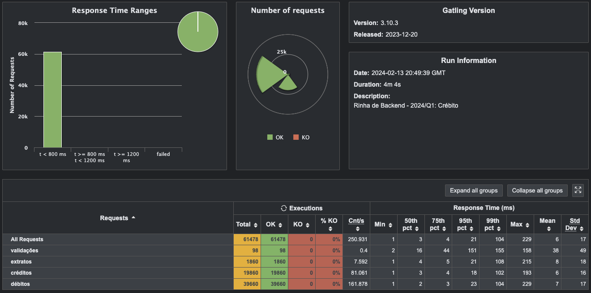

# Rinha de Backend 2024 Q1

- [Original challenge repository](https://github.com/zanfranceschi/rinha-de-backend-2024-q1)

## Tech Stack

- Go
- gin-gonic
- gorm
- PostgreSQL
- NGINX
- Docker

## How to run

```bash
make build-run
```

## Result

